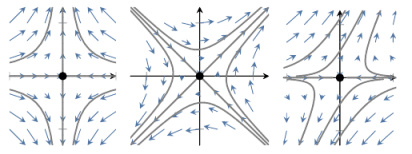
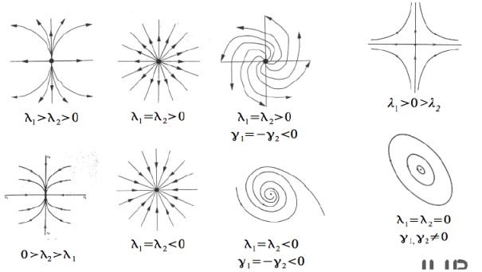

% Themenübersicht Visualisierung

\newcommand{\re}[1]{$\operatorname{Re}(#1)$}
\newcommand{\im}[1]{$\operatorname{Im}(#1)$}

# Datenformate und Gittermodelle

- Unterscheidung von Daten nach Quelle
	1. Messdaten
	2. Simulationsdaten

## Aufbau von Datensätzen

1. Diskrete Definitionsmenge $D$ als Teilmenge des Beobachtungsraumes $\mathcal{R}^b$ 
	- Geometrie des Datensatzes
2. Nachbarschaftsrelation der Punkte der Definitionsmenge 
	- Topologie des Datensatzes
3. Funktion auf Definitionsmenge
	- Attribute des Datensatzes

## Eigenschaften von Datensätzen

- **Dimension** des Beobachtungsraumes ($b=1,2,3,4, ...$)
- **Struktur** der Definitionsmenge (strukturiert oder unstrukturiert)
- **Struktur** der Nachbarschaftsrelation
	- keine $\rightarrow$ Scattered Data
	- unstrukturiert (Keine mathematischen Beziehungen zwischen Punkten - aber es gibt Relationen) 
	- strukturiert (Beziehungen zwischen Punkten können mathematisch beschrieben werden)
- **Dimension** der Nachbarschaftsrelation (Dimension der Zellen=1,2,3,4,...)
- Wertebereiche der Funktionen (Skalare, Vektoren, Tensoren, diskrete Wertebereiche, Verteilungsfunktionen, Farben)

## Anforderungen Visualisierungssystem

1. Kompakte Datenrepräsentation
	- sehr große Datensätze $\rightarrow$ speichereffiziente Repräsentation
2. Effizienz
	- Zugriff auf Daten in konstanter Zeit
	- damit Berechnung mit linearer Komplexität
3. Abbildbarkeit
	- schnelle Umwandlung der Daten in Grafikprimitive und Attribute
	- einfache Konvertierung des Ausgangsformates in internes Format des Systems

**Kompromiss finden zwischen Speichereffizenz und Zugriffseffizenz**

Deshalb häufig, bevorzugung einfacher Repräsentationen, da meist leicher optimierbar

## Typen von Daten

### Klassifizierung

- Geordnet
	- Ordinal oder Quantitativ
		- Ordinal: Kleidergröße, Ranglistenplatz
		- Quantitativ: Gewicht, Größe, Temperatur, Geschwindigkeit
	- Sequentiell oder Divergierend
		- Sequentiell: Alter, Größe, Druck
		- Divergierend: Temperatur, Geschwindigkeit, Höhe (über NN)
- Kategorisch (Dateiformate, Farben, Geschlecht, Typen)

### Skalare Werte

- Nominale Werte
	- Unterscheidung mehrerer Ausprägungen (also Unterscheidung durch Farben etc)
- Ordinale/Diskrete Werte
	- können geordnet werden (also Größe von Punkten etc)
- Kontinuierliche Werte
	- innerhalb Wertebereich alle Werte möglich (also Strahl mit allen Werten mit Farbverlauf etc)

\newpage

# Datensätze

## Kontinuerliche Daten

- Darstellung durch Funktion $f:D\rightarrow Z$
	- Definitionsbereich $D\subseteq \mathbb{R}^d$
	- Zielmenge $Z\subseteq \mathbb{R}^a$
- wenn Defintionsmenge $\mathbb{R}^2$ $\rightarrow$ Ebene, $\mathbb{R}^3$ $\rightarrow$ 3D-Raum, $\mathbb{R}^4$ $\rightarrow$ Raum+Zeit = **Feld** ***Aber ein Feld ist doch nicht nur da wenn Zeit??***
- Stetigkeit
	- Funktion heißt **stetig mit Ordnung k** oder $C^k$-stetig, wenn Funktion und alle Ableitung bis einschließlich Ordnung k stetig

## Begriffe

- **Stetiger Datensatz**
	- Tripel $D=(D,C,f)$ definiert stetigen Datensatz
	- $D$ Definitionsmenge
	- stetiger Datensatz mit durch $f$ gegebene Werte 
	- $C$ Wertebereich 
- **Geometrische Dimension**
	- Dimension $d$ des Raumes $\mathbb{R}^d$
- **Topologische Dimension**
	- Dimension $s \leq d$ = topologische Dimension
	- Dimension des Definitionsbereiches kleiner/gleich der des Wertebereiches
- **Kodimension**
	- Differenz aus geometrischer und topologischer Dimension
- ***Unterschied topologische und geometrische Dimension nicht wirklich klar***

## Diskrete Datensätze

- fast alle wissenschaftlichen Daten = diskret
- **Abtastung**
	- Umwandlung von kontinuierlichen in diskreten Datensatz
- ** Rekonstruktion**
	- Umwandlung von diskreten in kontinuierlichen Datensatz
	- z.B. Interpolation

### Datenstrukturen

- strukturierte Definitionsmenge
	- Punkte liegen in regelmäßigen Abständen in bestimmten Beobachtungsraum $\mathbb{R}^b$
	- geringerer Speicherverbrauch
	- schnelles Suchen von Punkten in Definitionsmenge 
- unstrukturierte Definitionsmenge 
	- Lage Punkte explizit angegeben
	- Lage nicht berechenbar

## Scattered Data
 
- Datensatz enthält keine Nachbarschaftsrelation
- Einsatz von speziell angepassten Interpolations/Approximationsverfahren
	- (modifiziertes) Shepard Verfahren
	- Hardys Multiquadrics
	- lokal konstante Interpolation auf Voronoizellen

### Shepard-Interpolation (Inverse Distanzwichtung)

- Annahme: je weiter ein unbekannter Messwert von einem bekannten Messwert, desto unähnlicher sind diese
- Multiplikationdes Messwertes mit Inversen des Abstandes zwischen Schätzpunkt und Messort
- $f_r(x)=\sum\limits_{i=1}^{N}\frac{w_{i} (x) \cdot f_{i}}{\sum_{j=1}^{N}w_{j}(x)}$ mit Gewicht $w_{i}(x)=\frac{1}{d(x , x_{i} )^p}$
	- $p > 0$ power Parameter
	- größere Werte für $p$: Einfluss von nahen Punkten größer $\rightarrow$ Voronoi Diagramme
	- kleinere Werte für $p$:interpolierter Wert mehr durch entfernte Punkte beeinflusst
- zur Berechnung eines Punktes werden alle Werte der anderen Punkte miteinbezogen
- Nachteil: Die Berechnung erfolgt immer auf allen Punkten. Deshalb zu Langsam für große Datensätze.

- Diagramm Interpretation
	- interpolierter Wert von **allen** Werten abhängig
	- interpolierter Wert strebt zu Mittelwert

#### Modifizierte Shepard-Interpolation

- nur Betrachtung von Punkten, die in Radius $R$ liegen

### Voronoi-Diagramme

- Zerlegung des Beobachtungsraumes in Voronoizellen 
- Bestimmung durch vorgegebene Menge an Punkten =**Zentren**

- für $B \subset R^b$ ***Folie 74 unklar***
- sofort ist ersichtlich, dass Voronoizellen endliche Schnitte von Halbräumen sind $\rightarrow$ Voronoipolygone
- Eigenschaften
	- konvex, da Schnitte konvexer Mengen selbst konvex
	- jeder Eckpunkt Schnittpunkt von mindestens drei Kanten
	- im Umkreis jedes Dreiecks liegt kein anderer Punkt

- Bedeutende Repräsentationen
	1. Array 
	- ***und wozu das ganze***
die durch eine vorgegebene Menge an Punkten des Raumes, hier als Zentren bezeichnet, bestimmt werden. Jede Region wird durch genau ein Zentrum bestimmt und umfasst alle Punkte des Raumes, die in Bezug zur euklidischen Metrik näher an dem Zentrum der Region liegen als an jedem anderen Zentrum. Derartige Regionen werden auch als Voronoi-Regionen bezeichnet. Aus allen Punkten, die mehr als ein nächstgelegenes Zentrum besitzen und somit die Grenzen der Regionen bilden, entsteht das Voronoi-Diagramm.

1. Aufbau von Datensätzen
	- 3 Bestandteile
	- Unterteilung nach 5 Kriterien
2. Anforderungen an Visualisierungssystem (4)

\newpage

# Skalarfelder

1. Definition Skalarfelder
2. Falschfarbendarstellung 2D/3D
	- Einfärbung, Höhenfelder, Isolinien
	- Schnittflächen, Isoflächen
3. Einfärbung (Color Maps)
	- Variationen $\rightarrow$ Vorteile, Nachteile
4. Isolinien 
	- ***Folie 150 unklar***
5. Isoflächen
6. Marching Cubes 

\newpage

# Vektorfelder

\newpage

# Merkmalskurven

\newpage

# Skalartopologie

\newpage

# Konturbaum

\newpage

# Volumenvisualisierung

HIer ganz viel anderes Zeug

\newpage

# Vektorfeldtopologie

## Motivation

- nicht der einzelne Vektor entscheidend
- wichtiger: Unterteilung Feld in Bereiche gleichen Stromlinienverhaltens
- Betrachtung von Vektorfeldern, deren Divergenz *nicht* verschwindet $\rightarrow$ d.h. nicht quellfrei sind

## Start-, Zielmenge

- Stromlinie $c:I \rightarrow D$ 
- stationäres Vektorfeld $v:D\rightarrow\mathbb{R^d}$
- Startmenge: $A(c_{p})=\left\{q\in D |\exists t_{n=0}^\infty\in \mathbb{R}, t_{n}\rightarrow \infty, \lim\limits_{n\to\infty} c_{p}(t_{n})=q\right\}$
- Zielmenge: $\Omega(c_{p})=\left\{q\in D |\exists t_{n=0}^\infty\in \mathbb{R}, t_{n}\rightarrow \infty, \lim\limits_{n\to\infty} v_{c}(t_{n})=q\right\}$

- i.A. Menge aller Becken (engl. Basin) endlich
    * ***Wie ist das mit den Becken zu verstehen?***
- **Vektorfeldtopolgie ergibt sich als Zerlegung der Domäne in zusammenhängende Komponenten der Schnitte von Start- und Zielmenge**
	- *zusammenhängend*: es gibt für je zwei Punkte eine stetige Kurve, die diese verbindet
- für jede Komponente der Zerlegung teilen sich alle Stromlinien eine gemeinsame Start- und Zielmenge

\newpage

### Kritische Punkte

- sind Nullstellen des Feldes $\rightarrow$ **Singulariäten**
- *Start- und Zielmenge eines kritischen Punktes ist der Punkt selbst*
- **Quelle**  alle Partikel innerhalb Nachbarschaft fließen aus Gebiet heraus
	

	
- **Senke** alle Partikel innerhalb Nachbarschaft fließen in Gebiet hinein
	

- ***Frage: erste Matrix bei beiden gleich??***
    - ***sollte bei einer senke negativ sein, oder?? (Martin)***

\newpage

- **Zentrum** alle Partikel fließen weder zu noch weg vom Sattelpunkt

- **Sattelpunkt** wenn Klassifizierung nicht eindeutig

\newpage

### Vergleich zu Skalar-, Gradientenfeldern

- wenn Vektorfeld gleich Gradient des Skalarfelder:
	- Minima werden zu Quellen
	- Maxima werden zu Senken
	- Sattelpunkte des Skalarfeldes werden zu Sattelpunkten des Vektorfeldes
- da Gradientenfeld wirbelfrei $\rightarrow$ keine Zentren in Gradientenfeldern
	- wirbelfrei, wennn Divergenz nicht verschwindet
	
## Lineare Vektorfelder

- Grenzwertbetrachtung über Ableitung des Vektorfeldes, da Feld bei hinreichend kleiner Nachbarschaft als lineares Feld angenommen werden kann
- lineares zweidmensionales Vektorfeld $v:\mathbb{R}^2\rightarrow \mathbb{R}^2$ wird vollständig durch 2x2 Matrix A beschrieben
- $v(x)=Ax$
- verschwindet Determinante nicht $\rightarrow$ einzige Nullstelle im Koordinatenursprung

#### Arten kritischer Punkte

- Analyse des Verhaltens um einen kritischen Punkt kann man aus Eigenschaften der Matrix ableiten
- dazu Bestimmung der komplexen Eigenwerte $\lambda_{j} lambda_{j} + i \cdot \gamma_{j}$
- zur Bestimmung des Tyos des kritischen Punktes verwendet man lokal lineares Feld

- **Senke** kritischer Punkt $p \in B$, falls Umgebung $z \in U \subseteq B$
    * $\lim\limits_{t \to \infty}c_{p}(t)=p$

- **Quelle** kritischer Punkt $p \in B$, falls Umgebung $z \in U \subseteq B$
    * $\lim\limits_{t \to -\infty}c_{p}(t)=p$

### Separatrizen

- sind Stromlinien
- Eigenschaften
	- können geschlossen sein (Zykel)
	- können an Quellen starten + an Satteln enden
	- können an Satteln starten + an Satteln enden
	- können an Satteln starten + an Senken enden
- Sattelpunkte sind wesentliche Punkte zum Finden von Separatrizen
	- Eigenvektoren an Sattelpunkten geben Orientierung der Separatrizen an
- Zykel stellen großes Problem in Berechnung dar

#### Algorithmus zur Bestimmung kritischer Punkte in 2D

1. Durchsuche alle Zellen nach Nullstellen im Vektorfeld
2. Für jede Nullstelle
	1. Berechnung Jacobimatrix $\rightarrow$ alle partiellen Ableitungen
	2. Ermittlung (komplexe) Eigenwerte $\lambda_{1}$, $\lambda_{2}$
	3. \re{\lambda_{1}}, \re{\lambda_{2}} > 0 $\rightarrow$ Quelle
	4. \re{\lambda_{1}}, \re{\lambda_{2}} < 0 $\rightarrow$ Senke
	5. \re{\lambda_{1}}, \re{\lambda_{2}} = 0 $\rightarrow$ Zentrum
	6. \re{\lambda_{1} \cdot \lambda_{2}} < 0 $\rightarrow$ Sattel
3. Darstellung aller Singularitäten und Separatrizen

\newpage

# Kohärente Strukturen

- Methoden zur Analyse zeitabhängiger Felder
	- Betrachtung fester Zeitpunkt
	- z.B. Euler $\rightarrow$ Ortszentriert $\rightarrow$ betrachtet Änderung von Größe an festem Ort
- **Lagrangesche Methoden** 
	- beziehen zeitlichen Verlauf der Partikel ein
	- basieren auf Partikelbahnen
	- Partikelzentriert $\rightarrow$ betrachtet Änderungen der Größen für festen Partikel

## Lagrangian Coherent Structures (LCS)

- keine allgemeingültige Defintion
- manche Definition mithilfe Wirbeln, andere Zusammenhang mit Grenzschichten

### Finite Time Lyapunov Exponent (FTLE)

- Idee: Berechnung der Separation von infinitesimal entfernten Partikeln über festgelegte **endliche** Zeitspanne

#### Flowmap

- gibt für festen Punkt den Endpunkt einer Pfadlinie nach festen Integrationszeit an

#### Berechnung FTLE

- Berechnung mittels Gradienten der Flowmap
- Die Spektralnorm ist in der Mathematik die von der euklidischen Norm abgeleitete natürliche Matrixnorm. Die Spektralnorm einer Matrix entspricht ihrem maximalen Singulärwert, also der Wurzel des größten Eigenwerts des Produkts der adjungierten (transponierten) Matrix mit dieser Matrix
- ***komme nicht weiter bei FlowMap***

\newpage

# Texturbasierte Techniken

- Darstellung/Analyse von Strömungen mithilfe **Schlierenbilder** 

## Spot Noise

- Zur Darstellung von Strömungsdaten Verwendung von Farbklecksen ("Spots")
- Formel: $f(x)=\sum_i a_ih(x-x_i)$
	- $a_i$ ist zufällig mit Erwartungswert 0 zu wählen $\rightarrow$ sonst würde von jedem Punkt der zugehörige Vektor angezeigt werden 
	- $h(x)$ gibt Form der Spots an
- Algorithmus
	1. Zufälliges Wählen von Position in Textur
	2. Zeichnen von Spot an dieser Stelle
	3. Form des Spots muss Richtung Vektorfeld wiedergeben
	4. Form des Spot $f(x)=\sum_i a_ih(m(d(x_i)),x-x_i)$
		- $m$ Attribute der Formparameter
		- $h$ typischerweise Ellipse (wird durch $m$ verkürzt/verlängert
- **3D Spot Noise**
	- selbés Vorgehen, Verwendung von 3D Texturen, 3D Spots
	- Umsetzung nicht gut, da Überdeckungsproblem $\rightarrow$ Zufällige Verteilung Spots ungünstig
- **Spot Noise als Faltungsfilter**
	1. Initialisieren Textur mit weißem Rauschen
	2. Interpretation des Spot als Faltungskern
	- Jeder Pixel $s$ am Pixel $p$ wird durch gewichteten Mittelwert der Pixel $p'$, die sich unter einem Pixel $p$ liegenden Spot befinden berechnet ***äh ja ist klaaaa***

### Direct Directional Convolution

- beim DDA-Faltungsverfahren wird Linie in Richtung Vektorfeld gerastert und über diese gemittelt
- Nachteil: stark gekrümmte Stromlinien verwischen

- Nachteile von DDA $\rightarrow$ Verwendung des Integral von Stromlinien (Linienintegralfaltung, Line Integral Convolution)

## Line Integral Convolution (LIC)

- algorithmische Nachbildung der Schlierenbilder
- Algorithmus
	- $c:I\rightarrow D$ Strom-/Pfadlinie mit $c(0)=x_0$ (also ein Punkt)
	- $T:D\rightarrow \mathbb{R}$ randomisierte Rauschtextur
	- $I(x_0)=\int_{-L}^{L}k(t)T(c(t))dt$
	- $k(t)$ Filterkern (endlicher Träger ***?***, normalisiert, meist symmetrisch)

### FastLIC

- Berechnung Integral als Summe
	- $I(X_i)\approx \sum_{i=i-N}^{i+N}k_iT_i$
- Und jetzt nochmal in einfach:
	- Bei LIC werden alle Punkte addiert
	- Optimierung: anstatt Addition immer wieder durchzuführen
	- Subtraktion des ersten Punktes der Linie & Addition des neuen Punktes
	- dadurch Durchlaufen der Linie performanter

### Erweiterungen LIC

- Probleme LIC
	- Verlust Richtungsinformationen
- **Oriented LIC**
	- Verwendung asymmetrischer Filterkerne behebt Verlust Richtungsinformationen
- **Volume LIC**
- Oberflächen-LIC
	- stabiller Integrator auf Oberfläche nötig
	- Abbildung Textur auf Oberfläche
- **Image Space LIC**
	- ***noch zu machen***
	- Probleme
		- berechnet viel Information, die nicht angezeigt wird $\rightarrow$ Lsg: Berechnung im Bildraum
		- Textur muss hochaufgelöst werden, damit Bilder sinnvoll $\rightarrow$ Lsg: Berechnung im Bildraum ***?***
		- senkrecht zum Betrachter verlaufende Strömung wird verrauscht dargestellt
		- Rauschen "bewegt sich" auf Oberfläche $\rightarrow$ Lsg: Rückprojektion

\newpage

# Merkmalsbestimmung

## Definition

- im Sinne Visualisierung: Teilmenge des Beobachtungsraum oder Definitiongsmenge, in der alle Punkte eine Bedingung erfüllen 
- Beispiele
	- Punktmerkmal: lokal, isoliertes Maximum der Temperatur
	- Kurvenmerkmal: Wirbelkernlinie
	- Flächenmerkmal: 3D-Schockfront
	- Regionenmerkmal: die meisten 3D-Wirbeldefinitionen

## Wirbel

- können geschlossen sein
- intuitiv klar, mathematisch nciht präzise formulierbar
- charakterisiert über Drehbewegung von Fluidelementen um gemeinsames Zentrum
- wenn Fluidelement selbst nicht um sich selbst rotiert $\rightarrow$ Potentialwirbel
- Helmholtz-Zerlegung
	- Vektorfeld $u=u_\Phi + u_\omega$
	- Zerlegung Feld $u$ in rotationsfreien ($\nabla\times u_\Phi =0$) und divergenzfreien ($\nabla\cdot u_\omega=0$) Anteil
- Wirbelstärke gleich Rotation des  Geschwindigkeitsfeldes $\omega = \nabla\times u=\nabla\times u_\omega= rot \ u$
- **Wirbelmodelle**
	- Rankinewirbel
		- jeder Wirbel hat Kern
		- Kern verhält sich wie starres Objekt
		- Außerhalb Kern: Verhalten wie Potentialwirbel (also Fluidelemente rotieren selst nicht)
		- Problem: Unstetigkeit der Wirbelstärke

	- Hamel-Oseen-Wirbel
		- Beschreibt zeitliches Verhalten eines Wirbels in zähen Flüssigkeit durch Navier-Stokes-Modell
		- für laminare Strömungen nah am echten Verlauf in Wirbeln
			- laminare Strömung: Strömung ohne sichtbare Turbulenzen $\rightarrow$ keine Abweichungen

		- Annahme: Unbegrenze Ausbreitung, kein Rand $\rightarrow$ Dadurch Abweichungen
	- Modell nach Tung
		- 4 Zonen: viskoser Kern, turbulente Diffusion, Transitionsgebiet, konstante Zirkulation
	- Wirbel in Regel rotationsbehaftetes Geschwindigkeitsfeld $\rightarrow$ zumindest in Nähe Wirbelkern (Ausnahme: Potentialwirbel)
	- nicht alle rotationsbehafteten Strömungen sind Wirbel
		- Poiseuille-, Couette-, Grenzschichtstörungen sind **keine** Wirbelströmungen
- Finden von Wirbeln
	- Isowertdefinition
		- Hohe Wirbelstärke $|\nabla\times v|=\geq\omega_{Schwellwert}$
		- Niedriger Druck im Inneren von Wirbel $p\geq_{Schwellwert}$
		- Hohe Helicity Density (Rotation um Vektorfeld) $\omega\cdot v > \epsilon_h$
	- Wirbelkernlinien
		- gezielte Suche nach Zentren von Wirbeln mithilfe Wirbelkerlinien
	- Verfahren nach Banks und Singer
		- Prädiktor-Korrektor-Verfahren 
			- Prädiktor schätzt Wert mittels expliziten Verfahrens (Explizites Verfahren: Zur Berechnung werden Näherungswerte herangezogen)
			- Schätzwert wird benutzt um korrigierten Wert (Korrektor) mittels impliziten Mehrschrittverfahrens zu berechnen (Implizites Verfahren: zur Berechnung wird der zu berechnende Wert benutzt)
			
			
		- Annahme: Rotation um Wirbelkern am größten & Druckminimum im Wirbelkern
	- Verfahren nach Sujudi, Haimes
		- in Wirbelkern nur Durchströmung entlang Kern 
		- Rotation beschreibt Wirbelkern
		- Algorithmus
			- nur Betrachtung Tetraederzellen
			- wenn konstante Ableitung komplex konjugierte Eigenwerte $\rightarrow$ Berechnung der einzigen reellen Eigenrichtung
			- Subtraktion diesen Anteil von Vektoren in Ecken $\rightarrow$ Bestimmung Nullstellen innerhalb Zelle
			- dort ist Wirbelkern

		
	- Parallel Operator
		- viele Wirbeldefinitionen basieren auf Parallelität zweier Vektorfelder ***warum auch immer***
		- ***hier fehlt noch was***

## Seprations- und Anschmiegelinien

- Stellen auf umströmten Gegenstand ...
	- an denen sich Strömung vom Objekt löst $\rightarrow$ Separationslinien
	- an denen sich Strömung an Objekt anschmiegt $\rightarrow$ Anschmiegelinien
- direkte Suche ist numerisch nicht möglich
	- Erkennung der Stellen durch Suche nach typischen Strömungsverhalten an der Oberfläche
	- entstehenden Kurven nicht stetig $\rightarrow$ einzelne Geradestücke (meistens nicht verbunden)
	-  Verfahren auch bei Rechteckgittern möglich
		- Berechnung/Schätzung Ableitung an Eckpunkten des Gitters
		- Richtung der Separations- bzw. Anschmiegelinien als Tangente an gesuchte Kurve betrachtet
		- das liefert stetige Kurven

## Zeitabhängige Daten

- Untersuchung jedes einzelnen Zeitpunktes
- Identifikation von Merkmalen über Zeit Problem, da Merkmalsfunktion diskrete Werte annimmt $\rightarrow$ unstetige Veränderung Veränderung der Merkmale
- viele Beispiele (insbesondere Isowertdefinition) deuten auf Möglichkeit stetiger zeitlicher Änderungen hin
- bisherige Ansätze verwenden *Abstände im Raum von einem Zeitpunkt zum nächsten* zur Identifikation der Merkmale; 
	- Entstehen eines Merkmals $\rightarrow$ Birth
	- Vergehen eines Merkmals $\rightarrow$ Death
	- Eintreten in Beobachtungsraum durch Merkmal $\rightarrow$ Entry
	- Verlassen des Beobachtungsraumes durch Merkmal $\rightarrow$ Exit
	- Auftrennen eines Merkmals in zwei oder mehr Teile $\rightarrow$ Split
	- Vereinigung mehrerer Merkmal zu einem Merkmal $\rightarrow$ Merge
	- ***Was ist genau gemeint mit Eintreten in Beobachtungsraum***
- Merkmalsextraktion allgemein
	1. Auswahl
	2. Gruppierung (Clustering)
	3. Attributberechnung
	4. Abbildung mit Icons

\newpage

# Render-Techniken

- Ziel
	- Realistische Darstellung mit wenig Rechenaufwand
	- Effiziente Berechnung dank programmierbarer Grafikkarten
- Dreiecksband ***wie spielt das Band an dieser Stelle rein***
	- Band wird zum Beobachter ausgerichtet
	- Schattierung per Textur oder Shadercode

## Ambient Occlusion (Umgebungsverdeckung)

- Ziel: mit geringer Renderzeit realistische Verschattung von Szenen zu erreichen
- Ergebnis nicht physikalisch korrekt, meist ausreichend um auf rechenintensive globale Beleuchtung zu verzichten
- Funktionsweise
	- basiert auf Beobachtung, dass in Ritzen und Ecken normalerweise geringe Beleuchtungsstärke
	- ankommendes Licht kann nur durch Geometrie blockiert/abgeschwächt werden
	- zwei Parameter pro Messpunkt berechnet: 
		- prozentualer Grad der Verdeckung
		- Bent Normal (zeigt in Richtung der prozentual niedrigsten Verdeckung) $\rightarrow$ kann später auch für erweiterte Beleuchtungssimulation benutzt werden
## Fake Tubes
- ***hier müsste noch bissl Text hin***

\newpage

# Immersive Visualisierung

## Begriffe

- Immersion
	- "Eintauchen in Szene virtueller Realität"
	- Traditionelle Darstellung auf Bildschirm, Interaktion mittels Maus/Tastatur, Eingabegeräte 3D bis 6D
	- Bewusstseinzustand, in dem Benutzer verminderte Wahrnehmung seiner Person erlebt $\rightarrow$ künstliche Szene/Welt
- Virtuelle Realität
	- 3D Umgebung
	-  Benutzer kann mit Umgebung interagieren
	- benötigt meist zusätzliche Eingabegeräte (Datenhandschuhe, Gesternerkennung, 3D-Verfolgung Benutzer)
- Erweiterte Realität
	- Realität durch zusätzliche Informationen ergänzt
	Darstellung durch halbtransparente Brillen/Ausgabegeräte/Projektionen
- Immersive Visualisierung
	- fast ausschließlich 3D
	- möglichst realitätsnah (Kopf-, Handbewegungen, haptisches ("fühlbares") Feedback)

## Augmented Reality (Erweiterte Realität)

- Umsetzung Mobilgeräte
	- Vorteile
		- Reale Objekte können genauer beobachtet werden
		- Bezug zur Realität immer gegeben
		- Orientierung/Positionierung einfach
		- Gerät dient auch als Eingabegerät
	- Nachteile
		- Limitierung durch Realität
			- kein Durchdringen von Wänden möglich
			- Vergrößerung reduziert Realitätsnähe
		- beschränkte Anzeigefläche
- Umsetzung 3D Monitor
	- 3D polarisiertes Licht oder Shutterbrillen
	- für mehrere Benutzer ausgelegt
	- Benutzerposition fest (Kippen Kopf nicht möglich)
	- Eye-, Headtracking bisher teuer oder langsam 
- Umsetzung mittels Display Wall/Power Wall
	- 6x2 Projektoren
	- zirkulare Polarisation
- Worbkbench
	- Arbeitsplatz als Metapher
	- Arbeiten auf Fläche vor Benutzer
	- In Regel kein Bewegen im Objekt sondern Manipulation Objekt in Nähe
- CAVE
	- mehrere Projektionswände, Benutzer steht in Mitte und kann sich frei bewegen
- Probleme
	- Interaktion mit nicht sichtbaren Objekten
	- Texteingabe (zusätzliche, virtuelle Tastatur; Spracherkennung)
- Hardwareaforderungen
	- Berechnung getrennter Bilder für jedes Auge
		- Bilder müssen konsistent gehalten werden (bei Animationen oder wenn Zufall Rolle spielt $\rightarrow$ Image-Space LIC)
		- synchrone Projektoren wenn Shutterbrillen
	- Berechnung Projektion anhand
		- Position Bildschirme zueinander
		- Form/Krümmung Bildschirm
		- Kalibrierung erforderlich für Position des Betrachters im Verhältnis zu Bildschirmen
	- Einbeziehung 6DOF Eingabegeräte ("six degrees of freedom")
	- Projektion
		- tranditionel werden runde Displays durch stückwüse lineare Displays approximiert
		- Toleration Fehler $\rightarrow$ Projektion einfacher, da Hardwarebeschleunigung möglich
- Erweiterung "Kollaborative Systeme"
	- Gemeinsames Betrachten Datensatz
	- Gemeinsame Interaktion
	- Sichtbarkeit der Interaktionsgeräte des anderen Benutzers
	- Telefkonferenz
		- Semantik der Interaktion
		- Zeigen mit Pointer oder HAnd möglich
		- Blickkontakt möglich
		- Zoom

\newpage

# Tensorfelder

## Zusammenhang Skalar, Vektor, Tensor

- Gradient eines Skalarfeldes ist Vektorfeld 
	- $v(x):=\nabla s(x)$
- Gradient eines Vektorfeldes ist Feld, welches an jeder Position eine Matrix als Wert hat
	- $m(x):=\nabla v(x)$
- Gradient eines Matrix-Feldes ist Feld, das an jeder Position 3D-Matrix als Wert hat

\newpage

# Einführung in die Diffusionsbildgebung

\newpage

# Grundlagen der CFG-Simulation
